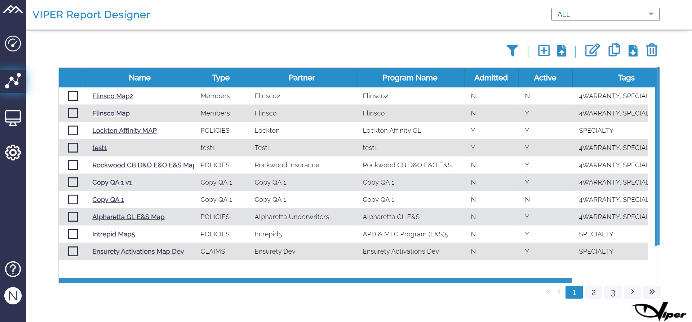
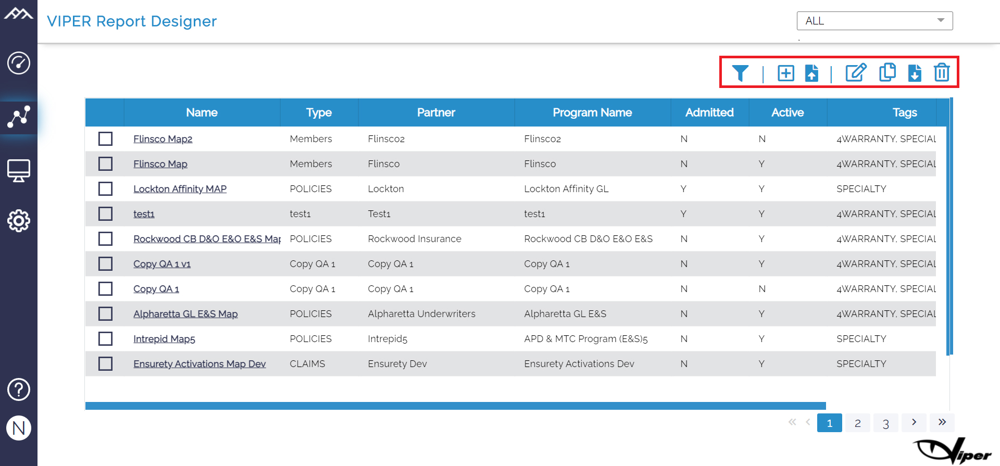
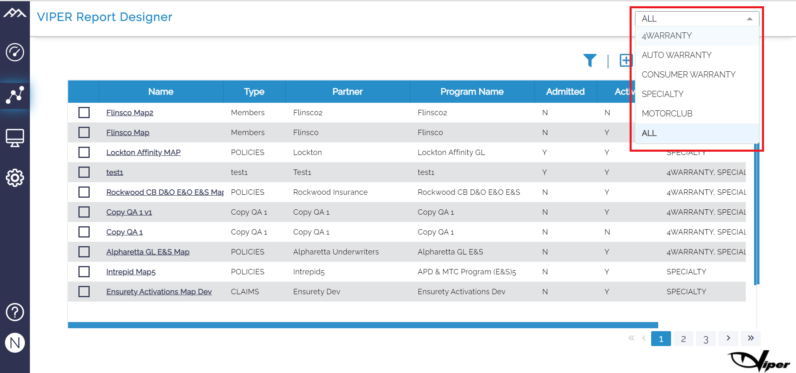
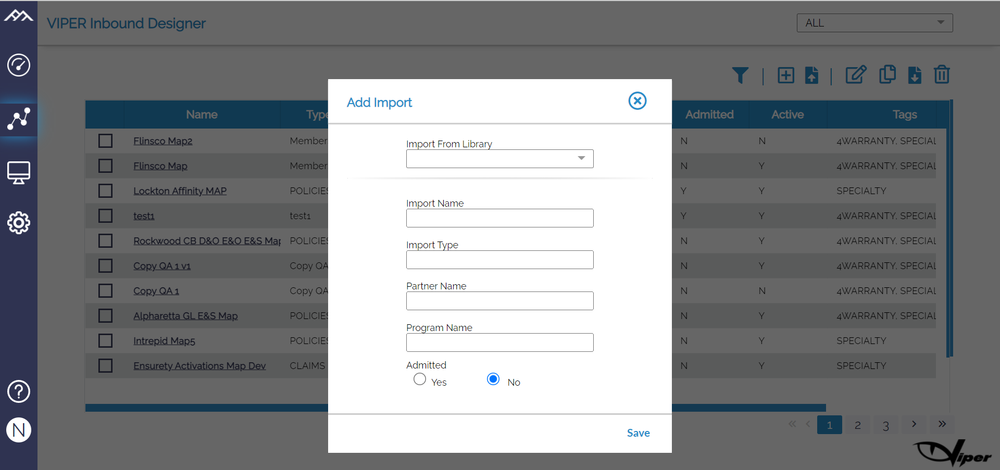
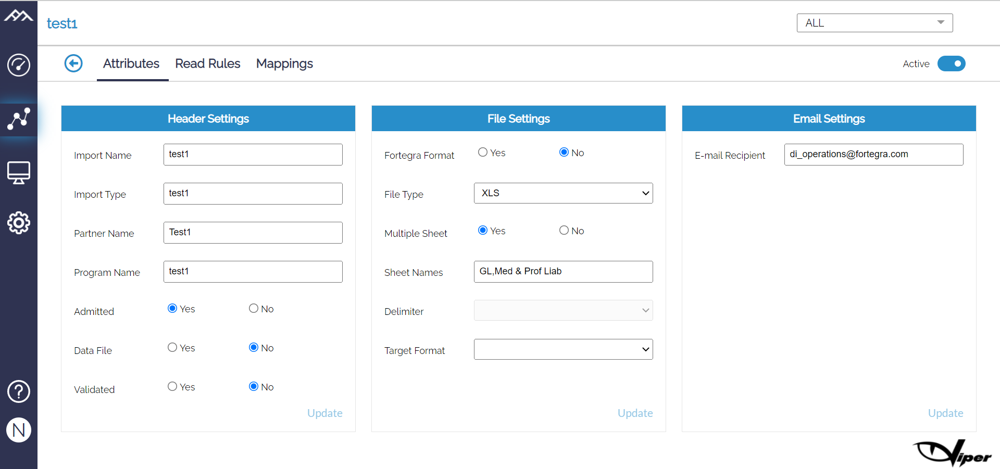
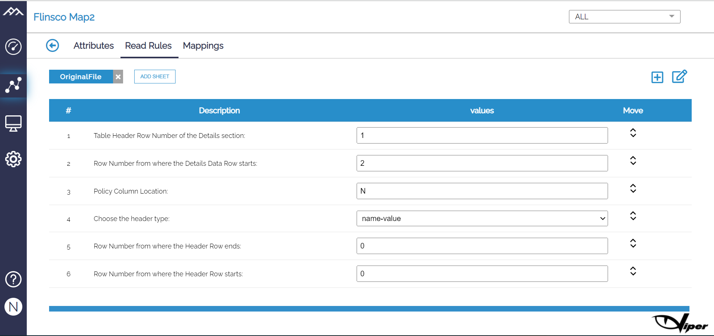
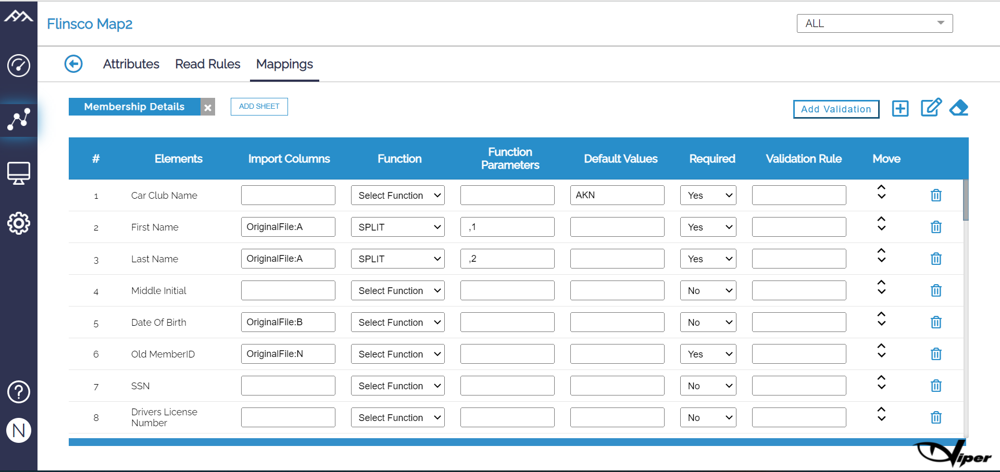
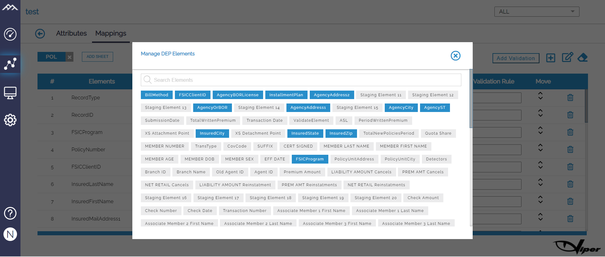
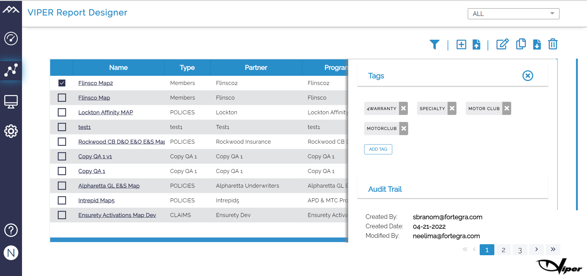

# Report Designer

Everything you need to know about your report and its accompanying files may be found in Report Designer it is the complete detail of incoming files and reports. Viper is able to read, convert, and construct the target file according to the business process requirement. For files or reports that have arrived in the software, you can discover them on the designer page, which lists their partner and identifies which department they belong to. 

 The designer page consists of-

```
1. Name
2. Type
3. Partner
4. Program name
5. Admitted (default values given according to the client)
6. Online (default values given according to the client)
7. Tags (Can be modified)
8. Version
```




The designer supports various actions using which you can add files, delete or remove existing maps, find specific maps by searching on name, type, partner, program name, tags required, copy mappings and you can also download the maps and import them on other servers. 

You can find on the top right corner icons that gives user the below options for maps: 

```
1.	Filter
2.	Create 
3.	Import
4.	Edit 
5.	Copy
6.	Export
7.	Delete 
```




It also has a search bar on the top most corner, where the departments are specified. It is a global filter so when you click on the name of the department and that can only be done when you have access to the department, you will be shown all the files related to the department.

Here 4Warranty, Specialty, Autowarranty, Motorclub are different department categories.




You can add a new report manually using the + icon on the top corner.

Click on the + icon and a 'Add New Report' pop up will display

Fill the details:

```
Add report from library
Report name
Report time
Partner name
Program name
Admitted (yes or no)
```

Select save and your Map will be updated successfully.




When you click on the selected file, the report will open with all the details.
Three main categories of the report are-

**1. Attributes**

Here we define different attributes of the report like partner Name, format of the incoming report, total number of sheets.

There are three different settings:

**Header settings**

```
a.	Report name
b.	Report time
c.	Partner name
d.	Program name
e.	Admitted (yes or no)
f.	Data file (yes or no)
g.	Validated (yes or no)
```

**File settings**

```
a.	Fortegra format (yes or no)
b.	File type
c.	Multiple sheets (yes or no)
d.	Sheets name
e.	Delimiter
```

**Email settings**

```
Email settings displays the email that the map has extracted or picked up.
 
```




**2. Read rules**

Viper gives you the option to add read rules if the user wants any new requirement or wants to make any customization during reading a file. For example if we want to specify that the header starts in row number 5, it can be specified in read rules. In this page we can add sheets to the report to add more options or customization. Click the + icon to add a sheet. It will show a drop down to add different sheets. 

Each sheet has three options: 

```
a) Description
b) Values
c) Reorder
```





**3. Mappings**

Every file or report has a map in Viper. We define in mapping how the various data elements in source file are mapped to targeted system for the partner. This is an extremely helpful function in Viper as so much can be done through these mappings. You can use split functionality, add parameters, assign default values, validation rules, transformation rules, etc to the elements. 

It consists of:

```
a)	Elements
b)	Values
c)	Function
d)	Function Parameter
e)	Default Values
f)	Required
g)	Validation rule
h)	Reorder
i)  Staging Elements
```

It also has a delete icon in case you want to remove anything from the given data.




Mapping Elements: 

We have various mapping elements that are added/deleted according to the business process requirement. When you click on the + icon on the mapping elements sheet it will show a pop up ‘Manage mapping elements’ with list of elements we can add. You can then add elements from the list to the sheet according to the requirement and update the maps. 

 



 

Functions: 

In mappings, when we click on Functions there is a drop-down box which appears with a list of functions which can be used according to the target requirement. Currently Viper supports these functions listed below: 

 

| **Function Name**                 | **Description**                                              |
| --------------------------------- | ------------------------------------------------------------ |
| IMS-Lookup                        | This function lets lookup in predefined dataset from IMS and extract the matching data. E.g. If program code is coming in raw data and you want description then you would use the IMS_Lookup function. |
| Split-Rows                        | Very specific to USMC for now. This function splits one row into many rows based on the condition defined. |
| If-ElseIf                         | Standard Conditional transformation like excel. IF (matching condition) then (value to return). Comes in handy wherever conditional translation required. E.g. Not null checks, specific value checks, format checks or simply conditional defaulting based on the incoming data. |
| Sum                               | Sum - Aggregate function that returns the total of a column for a specific conditions. E.g. total premium, cancelled amount etc. |
| Count                             | Count - Aggregate function that returns the count of the records for the give conditions. |
| min                               | Min.- Aggregate functions that returns the minimum value for the given range of records in a column. |
| max                               | Max - Aggregate functions that returns the maximum value for the given range of records in a column. |
| Extract_City                      | Extracts the City from the address. You need to specify the address format. |
| Extract_State                     | Extracts the State from the address. You need to specify the address format. |
| Extract_Zip                       | Extracts the Zip from the address. You need to specify the address format. |
| PolicyNumber_Format               | Applies the standard Fortegra policy number format by removing all spaces anywhere in data. |
| Concat                            | String concatenation function that combines the two or more values into one. |
| Sum                               | Sum - Aggregate function that returns the total in the same row for the given range. |
| Minus                             | Minus - Returns the difference between two columns in a row. |
| Multiply                          | Multiply - Returns the multiplication between the columns in a row. |
| Divide                            | Divide - Returns the division results between columns in a row. |
| Percentage                        | Percentage - Returns the % results between the columns in a row. |
| Numeric_Format                    | Applies given number format on the raw data.                 |
| IF-Exists                         | Returns the boolean (true/false) for the matching conditions. |
| If-exists-across-sheets           | Returns the boolean (true/false) for the matching conditions across sheets. |
| Validate-USMC-extended-Policy     | Validation functions specifically designed for USMS to check if policy is extended. |
| ValidateCountAcrossSheets         | Validate functions to validates the records counts across sheets for the specified column name. |
| ValidateSum Between Sheets        | Validate functions to validates the records sum across sheets for the specified column name. |
| ValidateMax Between Sheets        | Validate functions to validates the records Max across sheets for the specified column name. |
| ValidateMin Between Sheets        | Validate functions to validates the records Minimum across sheets for the specified column name. |
| Sequence-Number-Generator         | Generates the sequence number for a column                   |
| PolicyNumber Checks across Sheets | Validates if policy numbers exists in all given sheets.      |
| FSIC Program checks across sheets | Validates if FSIC Programs exists in all given sheets.       |
| Sub String                        | Take the part of String                                      |
| Split                             | Split First and Last names from the Name field               |
| Extended Policy                   | Same Policy Number with different FSICProgram                |

 

 

**4. Tags**

​    Tags are means of classifying the maps. User can add tags for a particular map by just clicking on the map. It will provide a side pane to enter tags for the map. This function which will remain same for the three pages - Designer, Monitor and Schedule. Any changes made in the tags for the map will be reflected on all three pages.   


