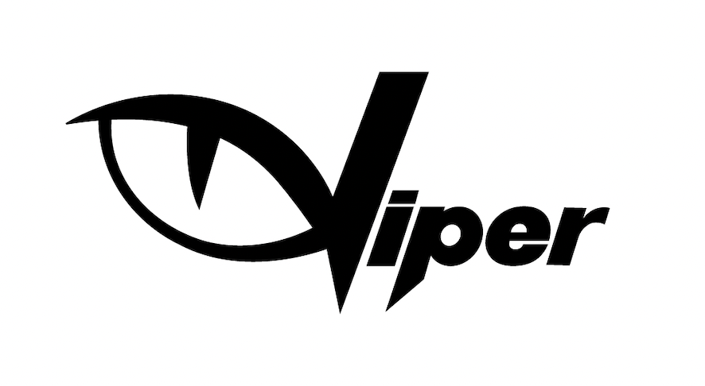

<a href="/#/concept" style="display: flex;
    flex: 1;
    align-items: center;
    justify-content: center;">

  

<strong style="color: #000">Variable Inbound Processing and Exception Reporting</strong>
  <!--  -->

</a>

  

    <a
      href="/#/mapping"
      style="
        flex: 1;
        background: #fff;
        border: 3px solid #303451;
        margin: 20px;
        border-radius: 5px;
        position: relative;
      "
      >

      <strong style="width: 200px; display:flex; color: #303451; font-size: 30px; font-weight: bold; margin-left: 20px; margin-top: 10px;"
        >Concept</strong
      >
      <small style="width: 200px; display:flex; margin-left: 20px;text-align: left; font-size:14px;">In depth explanation of Concepts &amp; Viper Terms</small>
      

      </a
    >
    <a
      href="/#/configuration"
      style="
        flex: 1;
        background: #fff;
        border: 3px solid #298EC9;
        margin: 20px;
        border-radius: 5px;
        position: relative;
      "
      >

<strong style="width: 200px; display:flex; color: #2f3451; font-size: 30px; font-weight: bold; margin-left: 20px; position: absolute;top: 10px;
    text-align: right;color: #298EC9;"
        >Configuration</strong
      ><small style="width: 200px; display:flex; margin-left:20px; text-align: left; font-size:14px;position: absolute;
    top: 50px;"
        >Let's walk you through all the configuration that is required for
        report processing &amp; manage expected schedules
      </small></a
    >
     <a
      href="/#/monitor"
      style="
        flex: 1;
        background: #fff;
        border: 3px solid #303451;
        margin: 20px;
        border-radius: 5px;
        position: relative
      "
      >

<strong style="width: 200px; display:flex; color: #2f3451; font-size: 30px; font-weight: bold; margin-left: 20px; margin-top: 10px; color: #303451;"
        >Monitoring</strong
      ><small style="width: 200px; display:flex; margin-left:20px; text-align: left; font-size:14px;"
        >Understand how reports are being monitored and parter collaboration is
        implemented</small
      ></a
    >
    <a
      href="/#/dashboard"
      style="
        flex: 1;
        background: #fff;
        border: 3px solid #298ec9;
        margin: 20px;
        border-radius: 5px;
        position: relative;
      "
      >

<strong style="width: 200px; display:flex; color: #298ec9; font-size: 30px; font-weight: bold; margin-left: 20px; position: absolute;
    top: 10px;
    text-align: right;"
        >Insights</strong
      ><small style="width: 200px; display:flex; margin-left: 20px; text-align: left; font-size:14px;position: absolute;
    top: 50px;""
        >How Viper enables the processing data through its dashboard
        features</small
      ></a
    >
  

