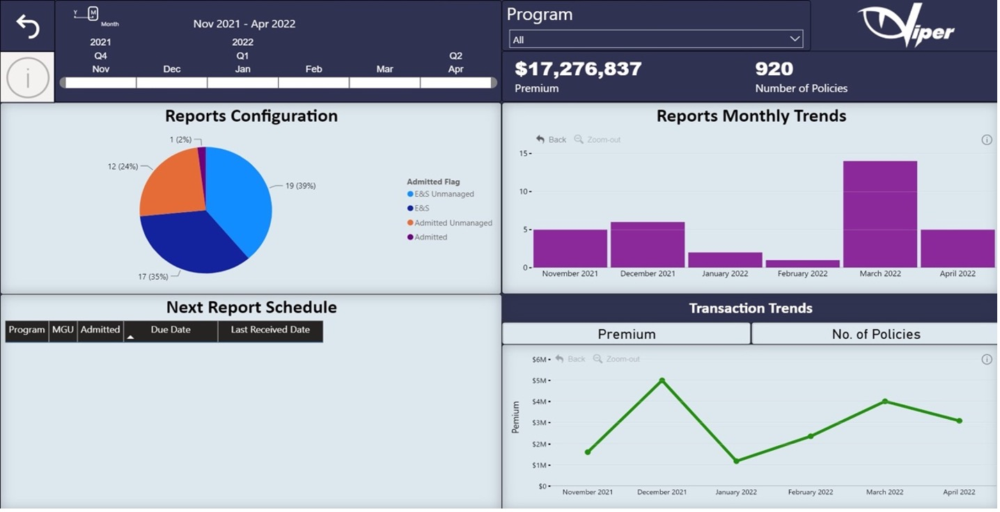

# VIPER Dashboard

It is a type of graphical user interface that commonly gives at-a-glance displays of key performance metrics, a detailed understanding of every single file that has been uploaded in the software. It is a great way of information management, makes the work more efficient and quickly.



The dashboard includes:

**1. Reports configuration**

This includes all the reports details with respective to a month, quarter and year. It also has four categories:

```
a)	E&S Unmanaged
b)	E&S
c)	Admitted Unmanaged
d)	Admitted
```

**2. Reports monthly trends**

It will tell you how many files are processed monthly

**3. Next report schedule**

This will show what reports are to be processed next with the due date and the received date

**4. Transactions trends**

It is a line graph with premium or number of policies on the Y axis and the date on the X axis

**5. Search bar**

There is a search bar on the top bar using which you can select a particular report or multiple reports and see the graphs for the selected reports.

**Purpose**

The purpose of the Viper dashboard is to make the life of the user easy, as the data uploaded in the software can be overwhelming as it is dense in quantity however the dashboards make it easier to understand, identify and differentiate. The visual representation of all the details of the report is present here, makes the data transparent and easily accessible.
