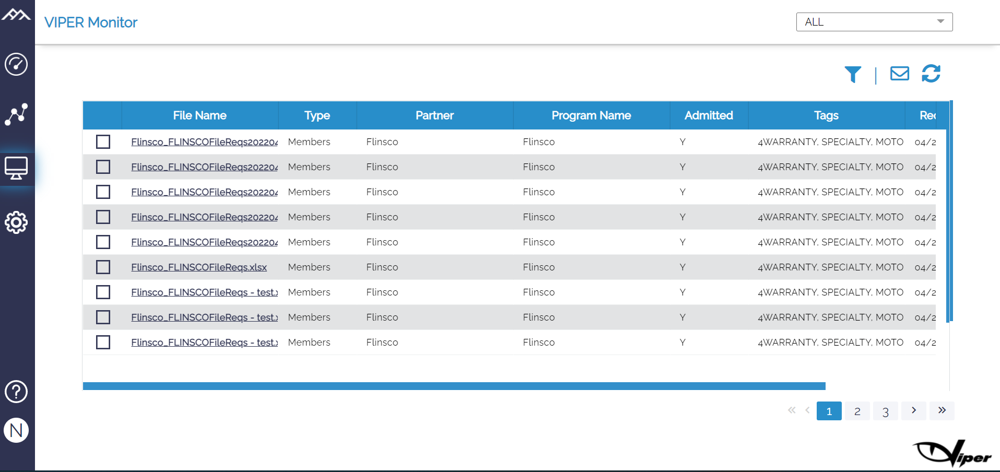

# Monitor Page

This page shows the status of the maps, and all the executed maps are shown here. This page is a detailed copy of the processing files. Viper also sends a success or failure notification via mail once the status of the report has been updated. User can download the source and target files by clicking on the File Name and Status fields links and it includes- 

```
a)	File name
b)	Type
c)	Partner
d)	Program name
e)	Admitted
f)	Tags
g)	Received
h)	Status
```


