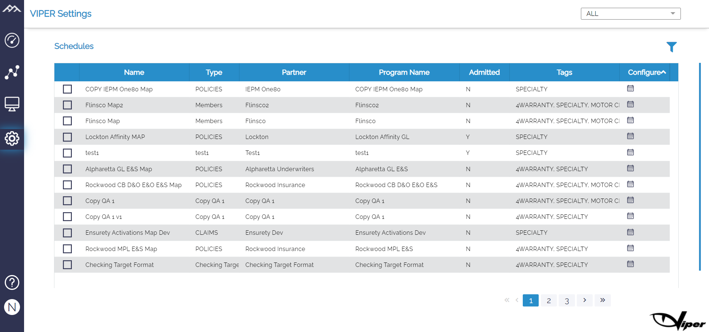
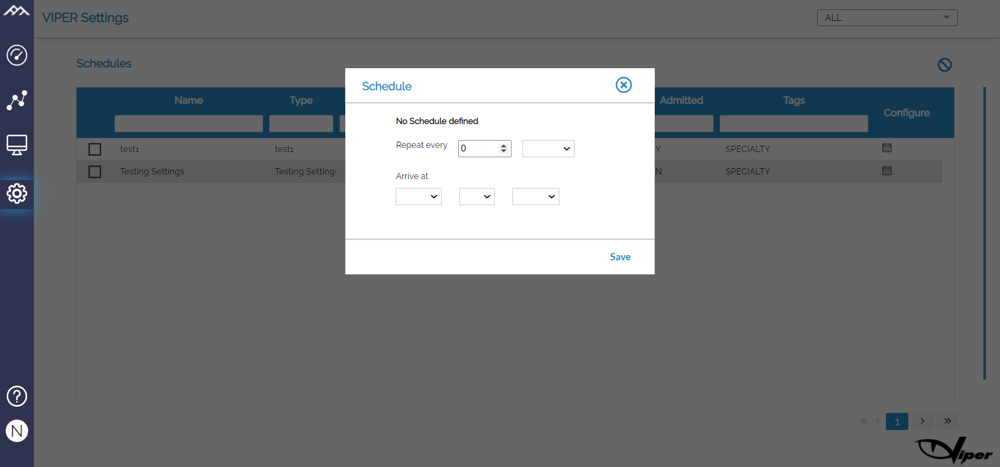
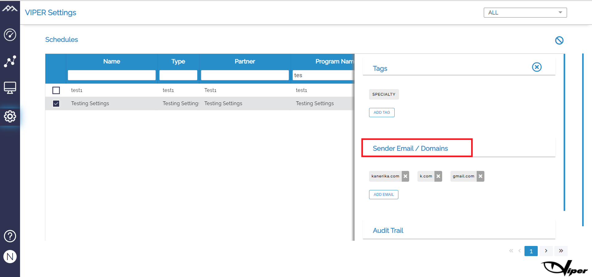

# Schedule Page

This page is in sync with the designer page however it has configuration options where we can modify the schedules for the projects to receive the source files from MGU and we can set the email domain for receiving the reports from the mentioned domains. It includes:

```
a)	Name
b)	Type
c)	Partner
d)	Program name
e)	Admitted
f)	Tags
g)	Configure
```



The Configure option can be used to add/change the schedule for the report. 





The domain/sender’s email needs to be specified for the software to receive the files, if we don’t set the email the DI robot will not pick up the files. We can have multiple domains for the report. This can be done using the filter icon on the top right corner. 



